# Running the Body Tracking Application  

1. Files and Folder Locations  
2. Running the Back-end  
3. Running the Unity Application  
4. Notes

When you want to run the `app : Body Tracking Application` on the HoloLens 2 Device, there are a few files and a few setup steps required for the application to be able to run properly.  

# 1. Files and Folder Locations  

The two important files required to run the application are:  

> ### **BodyTracking-App-Hatlab.sln**  
>  
> The `file : BodyTracking-App-Hatlab.sln` file is what is used to load and run the Unity application on the HoloLens 2 headset.  
>  
> **Loc:** C:\Users\hatla\Documents\HATlab-BodyTracking\BodyTracking-App-HATlab\BodyTracking-App-Hatlab\Builds  
>  
> The following folder path takes you to the folder location where the unity application build is created. Note that `...\HATlab_BodyTracking\...` is the pinned `pin : folder : HATlab_BodyTracking` folder. the build folder can also be found by following the folder path from the pinned folder. There are two folders contained within the builds folder:   
>  
> * **b1.0.0 debug**  
> * **b2.0.0 release**  
>  
> *Note:* The meaning of these two folders is described in more detail in the `doc : Unity` documentation.  
>  
> In brief, when creating a build in unity, certain build settings can be turned on to help with debugging the application, however, this causes the application to run significantly slower. A release build does not compile the extra code for debugging and will thus run much faster (better frame rate etc.).  
>  
> By opening one of the two folders, you will find inside the `file : BodyTracking-App-Hatlab.sln` file. This file can be opened in `IDE : Visual Studio (purple)` where we will perform later steps to run the application.  
>   
> 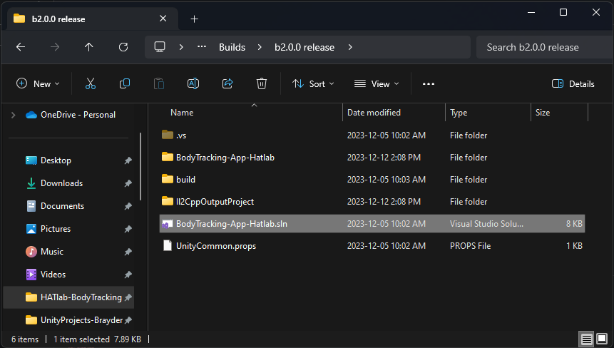 

> ### **TCPServer.py**  
>  
> The `file : TCPServer.py` file is what is used to communicate data between the HoloLens 2 headset and the PC the headset is connected to.  
>  
> **Loc:** C:\Users\hatla\Documents\GitHub\openpose\build\examples\tutorial_api_python  
>  
> The following folder path takes you to the folder location where the `file : TCPServer.py` file is located.  
>  
> this folder can alternatively be found by opening the `shortcut : Openpose-Python-Scripts` in the pinned `folder : HATlab_BodyTracking` folder.
>   
> 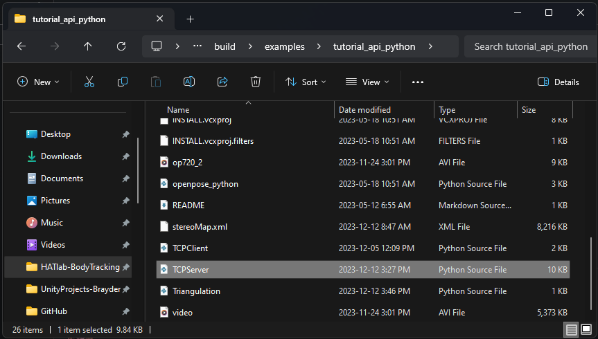  

---

**Note:** On the side bar of the folder window is a pinned folder `pin : folder : HATlab_BodyTracking`. This folder contains either direct folder access or shortcut folder access to all of the necessary locations of files pertaining to the body tracking project (the unity application, python scripts, and documentation files).  

|Files|Folder|
|-----|------|
|Unity Application/C# Scripts|*BodyTracking_App_HATlab*|
|Python Scripts|*Openpose-Python-Scripts*|
|Documentation|*Documentation*|  

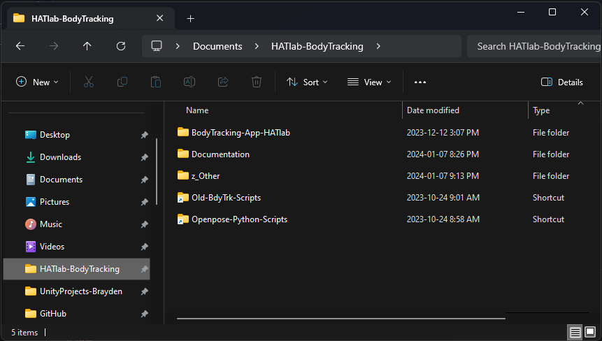  

# 2. Running the Back-end  

When running the Body Tracking Application, it is a **good habbit to always start the back-end before running/starting the unity application** on the HoloLens 2 Headset. This is because, in the Unity application, there are certain C# methods that are executed only during the startup portion of running the application that are used to establish TCP communication connections between the HoloLens 2 device and the PC. Once the startup is finished, those C# methods are not run again and the application will not try and make a new TCP connection if one was not established. There is, however, a voice command that will help you establish a TCP connection if one is either not made or a connection is lost during runtime. This is explained further in the `doc : C# Classes : Other_classes.pdf` document.  

To run the back-end we will do the following steps:  

1. Go to the folder where the `file : TCPServer.py` file is located, then go back one folder in the path. This will put you in a folder called `folder : examples`  
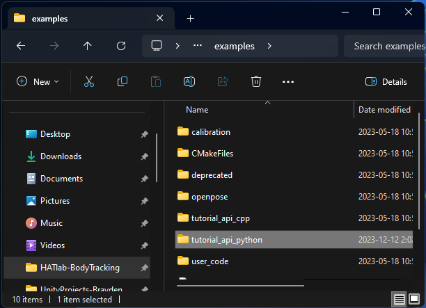  

2. Right click on the `folder : tutorial_api_python` folder and select `show more options`, then click on `Open with Code`  
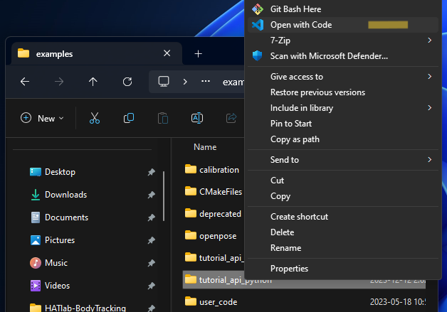  

3. Once `IDE : VS Code (blue)` opens, make sure the `file : TCPServer.py` file is opened and selected in the editor window. With the file selected, from the top right corner of the VS Code window we can **run the python file** by clicking the play button or by selecting "**Run Python File**" from the dropdown. This will start the back-end  
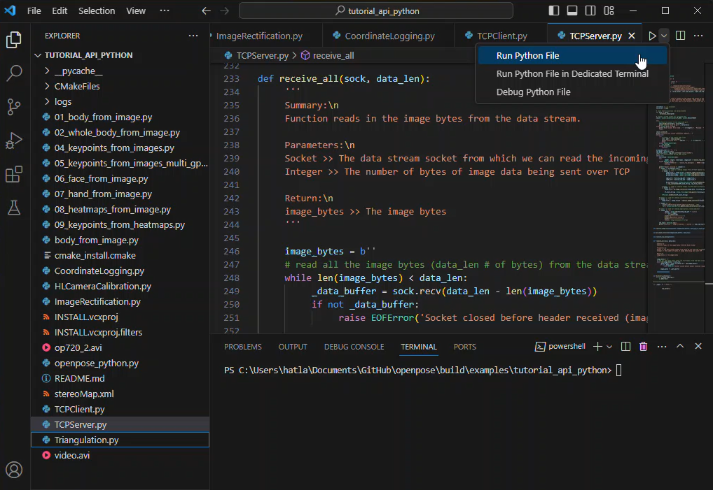  

4. We know that the back-end is running and ready when the terminal output shows "*Listening for client connection requests...*" 
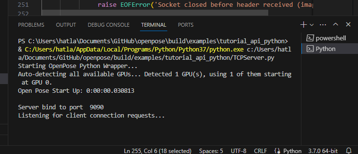  

The PC back-end is now running and ready for the Unity application.  

# 3. Running the Unity Application  

To run the Unity application on the HoloLens 2 headset we will do the following steps:  

1. **Turn on and Connect the HoloLens 2 device to the PC** using a usb-C to usb-C cable. Make sure the usc-C port used on the PC is the port farthest from the laptop screen (closest to the front edge). The application may still work with the other port, I just have not tested this (parts of the application specify specific port/IP values)  

2. Go to the folder where the `file : BodyTracking-App-Hatlab.sln` file is located (either the **debug** or **release** folder) and click on the `file : BodyTracking-App-Hatlab.sln` file to open it with `IDE : Vusial Studio (purple)`  
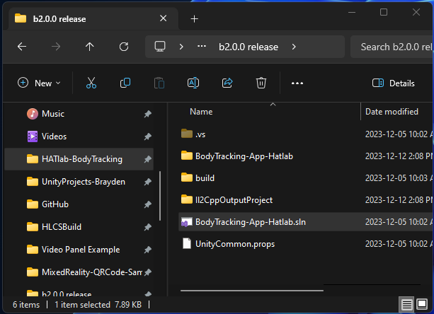  

3. Once Visual Studio has opened the .sln file, we want to set a few options before we run the application:  
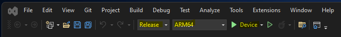  

* **Release:** Depending on the type of build we created using the Unity editor, we can have created a `build : Release` or `build : Debug` build. Under the `Release` drop down menu, we will select the setting that matches our Unity build type (Release > Release **or** Debug > Debug).  
*Note: By selecting the Debug option, a different screen will appear when the application is run that shows the processes occuring and prints any debug logs in the code.*  

* **ARM64:** This setting should always be set to `ARM64` as this is the architecture of the chip in the HoloLens 2 device.  

* **Device:** this setting should always be set to `Device` as long as the HoloLens is connected to the laptop via a cable.  
*Note: It is possible to connect the HoloLens to Visual studio wirelessly, in this case you would use **Remote Machine**, however, this was not something I was able to get working. This is something that could be explored further if wireless TCP communication is implemented.*  

4. Once the above settings are set, we can run the application. Note that running the application is also dependent on the type of build we are using:  
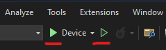

* **Start Debugging:** When we are running a `build : Debug` build, clicking the `solid green play button` will start the Unity application in the Debug mode. This will open screens that give us the helpful debugging information.  

* **Start Without Debugging:** When we are running a `build : Release` build, clicking the `hollow green play button` will start the Unity application only on the HoloLens headset.  

5. The application will start another build process to create the application that will be loaded onto the HoloLens 2 headset and executed. Note that this process can take anywhere from 30 seconds to 5 minutes depending on the type of Unity build and how many changes were made to the Unity application if a new Unity build is created.
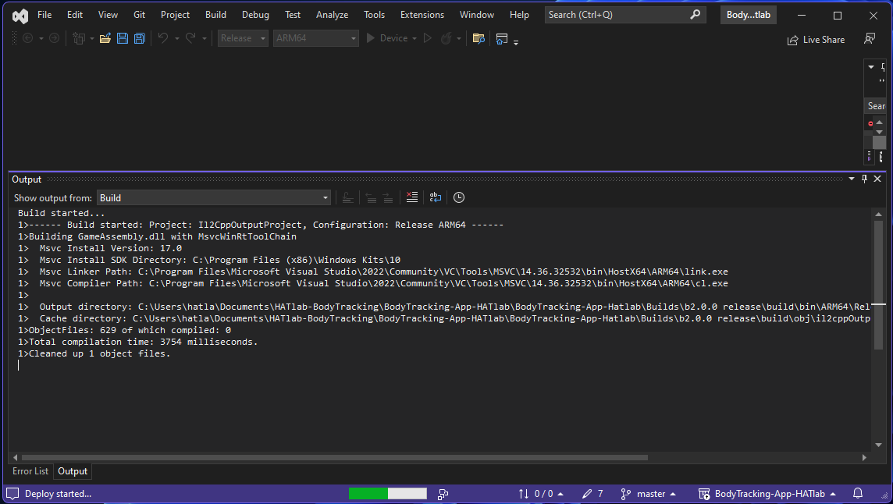  

6. When the build is finished, the Unity application will automatically be run on the HoloLens 2 Headset. This is identified by a graphic shown on the HoloLens headset. A successful completion of the build process is also identified by the below output in the Visual Studio output window  
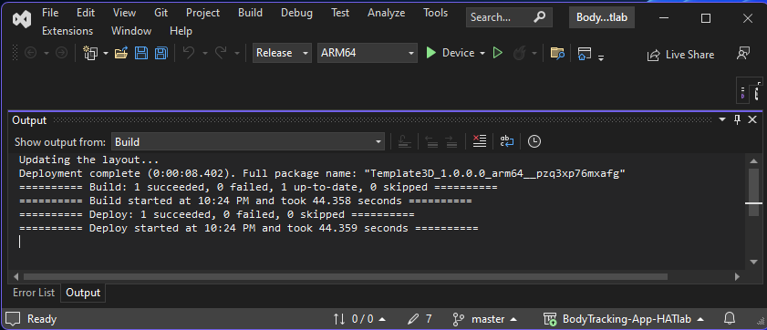  

At this point the Unity Body Tracking Application should be running on the headset. If an error occurs or the application does not start properly on the HoloLens, this can usually be fixed by repeating `step 4` and re-running the application.  

Once both the Unity application and Back-end application are running, the `back-end : TCPServer.py` will write to the terminal "**Connected with {IP}**" to signify the Unity application and the back-end have established a connection.  
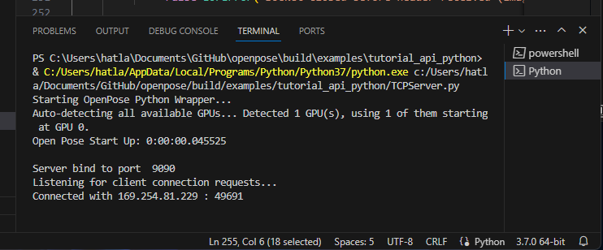 

# 4. Notes  

* If the `back-end : TCPServer.py` disconnects from the Unity application and a TCP connection needs to be re-established, using the voice command `command : "Connect Server"` should re-establish a connection and allow you to continue using the application without needing to re-run it from Visual Studio.  

* An error may sometimes occur when trying to run the application from Visual Studio where it is not able to successfully build and deploy the application to the HoloLens. This can be fixed by:  

    * Go to the specific build folder inside the Unity application for the build you are trying to run (either *1.0.0 debug* or *2.0.0 release*)  
    * Delete all the sub-folders and files inside the specific build folder so that its empty  
    * From the Unity editor, create a new build of the specified type (debug or release)  
    * Re-open the solution file in Visual Studio and follow the above steps to run the Unity application  

* After making changes to any part of a Unity project, creating a new build from within the Unity editor is required to see the effects of those changes in the running application. Make sure to navigate to the appropriate build folder to create your build. If you are updating a build (ie. creating a new release version) it is okay to overwrite the old build. Doing this will only update the necessary components.  

    * Note: If you have deleted all the sub-folders and files in a build folder, or have created a new folder to contain a Unity build, during the first runtime of the application two permissions pop-up windows will appear at the start of the application in the HoloLens 2 headset. You can select `yes/accept` to both. This is what allows us to use the cameras, sensors, and microphone built into the headset.  
    * Any successive time you overwrite this build with a new version, the pop-ups will not appear.  
    * **Note:** The pop-ups may cause an error in some of the application start-up procedures. If this is the case, re-run the application from Visual Studio.  

* When starting the application from Visual Studio, it is important to **keep it pointed in the direction of the mirror**. When the application goes through its start-up procedure, a coordinate system is defined and the game object person model is loaded into the world relative to that coordinate system. I have not found an effective way to drastically modify the game objects position in the scene, thus, the current effective solution is wearing the headset and looking at the mirror until the application has started. Once the application start-up is complete, you are free to move around the room or use the voice  outlined in the `doc : C# Classes : Other_classes.pdf` document to make minor adjustments to the game object position.
