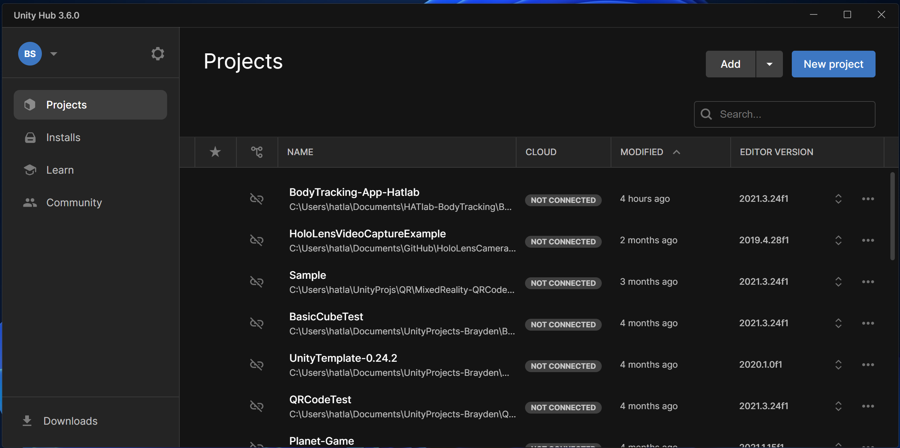
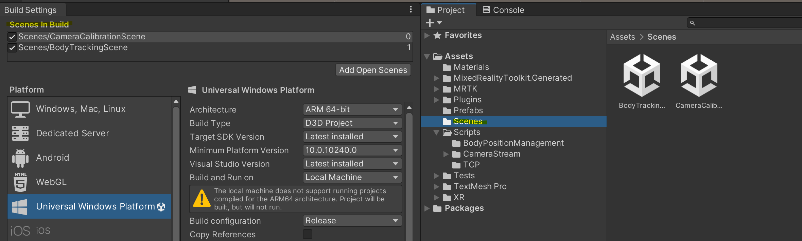
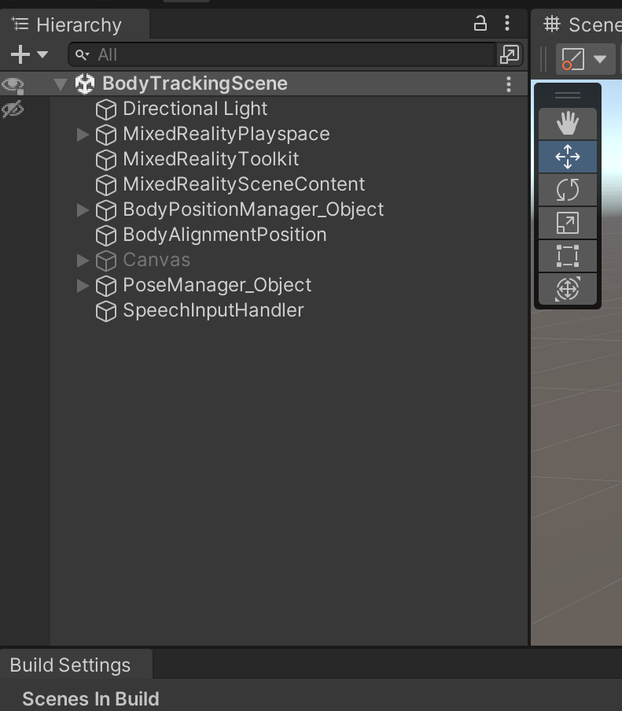
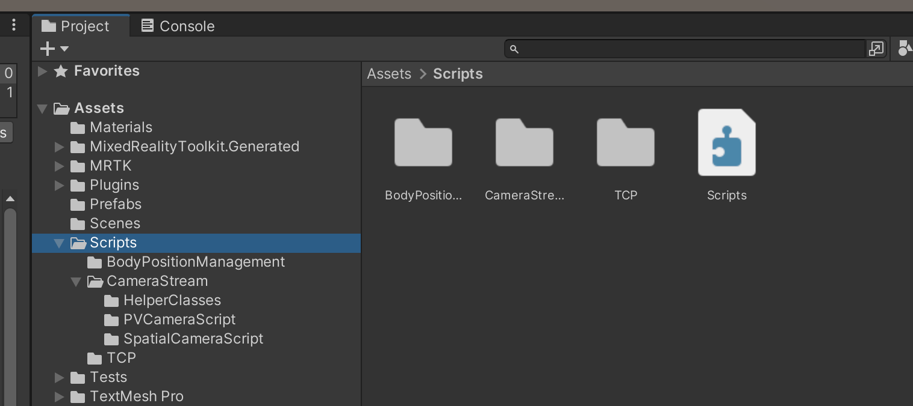
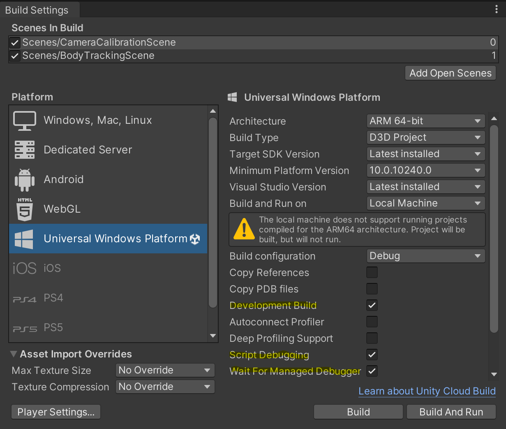
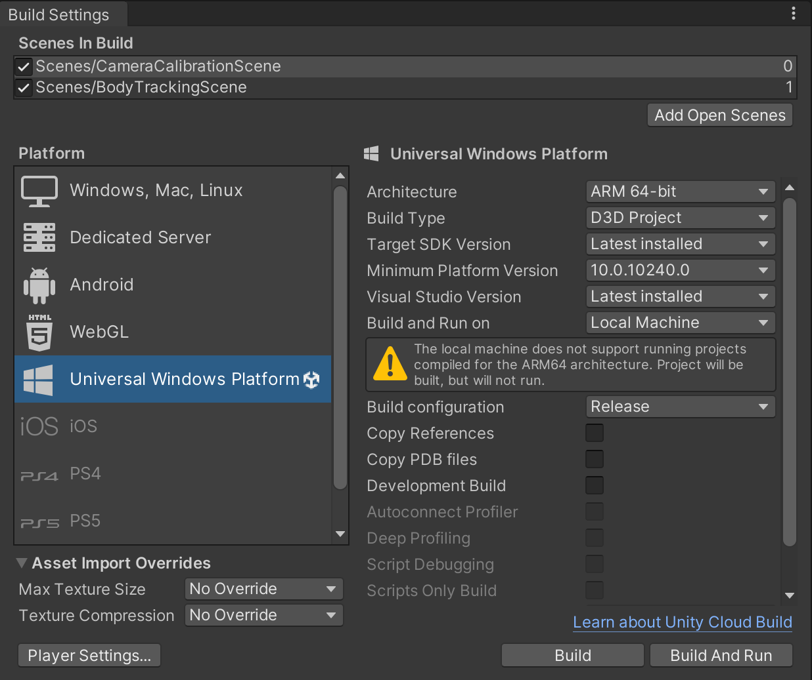

# Body Tracking Unity Application  

1. Opening the Unity Project  
2. Body Tracking Project Components  
3. Building the Application  
    A) Debug Build  
    B) Release Build  

# 1. Opening the Unity Project  

Our body tracking application is crated using the Unity game engine. To see all the components of the applications you can go to the following file path:  

**Loc:** C:\Users\hatla\Documents\HATlab-BodyTracking\BodyTracking-App-HATlab\BodyTracking-App-Hatlab  

Contained within the above folder are all the sub-folders and files that hold all the data for our project. The two main components of the Unity project that we will focus on are `sub-folder : Assets` and `sub-folder : Builds`, however, these will be talked about later. By accessing the above folder, this only allows us to see the files associated to the project and does not allow us to directly access or change components, objects, or fucntionality. To do this we will open the project using the `app : Unity Hub` application.  

1. Open the `app : Unity Hub` application from the bottom windows menu bar (white cube icon). This will open to the project browser where we can select and open our Unity project in the Unity editor.  
  

* The project we want to open is the project labeled `BodyTracking-App-Hatlab`. This is the most current version of the Body Tracking application.  
*Note: If you are curious to view the origins of the project, the project labeled `HoloLensVideoCaptureExample` is the basis of the current project.*  

2. After selecting the `BodyTracking-App-Hatlab` project, the Unity editor window will open. This is where you will be able to create, modify, and view the different scenes, game objects, and settings/functionality of the application.  

# 2. Body Tracking Project Components  

Once in the Unity editor, we have the opportunity to see all of the components of the project and modify the overall function of the application via the various game objects and settings. The Three important areas in the Unity editor are:  

* **Scenes**  
* **Hierarchy**  
* **Scripts**  

## Scenes  

  

Scenes define the different stages that the application with go though. In its current state, the application has two stages:  

### Camera Calibration  

The camera calibration scene hosts all the objects and functionality used for capturing calibration images using the headset as well as triggering the calibration step and a button for moving to the next scene.  

### Body Tracking  

The body tracking scene is the second stage of the application. Once the stereo cameras have been calibrated, we can then use them for body tracking. The purpose of this scene is to track the user and display visual feedback about their body movement. The game objects in this scene reflect this functionality.  

*Note:* When running the application on the HoloLens, to have both the calibration and body tracking scenes as a part of the running application, it is important to make sure that in the `Build Settings > Scenes in Build` that **all scenes have a checkmark**. This goes for any additional scenes added to the application. This makes sure they are build into the application.  

## Hierarchy  

  

The hierarchy specifies all of the game objects currently in the scene. Note that a `Game Object` does not specifically refer to a physical 3D model object in the game space. Some game objects run tasks solely in the background like the `object : SpeechInputHandler`. The only job of the SpeechInputHandler game object is to listen for voice commands and execute the associated action, however, to be able to have this functionality, we must have a game object to attach our custom scripts to so that Unity knows to perform the actions.  

Game objects do not have any functionality on their own, it is the scripts we attach to the game object that allow us the ability to calculate, update, and display things for the user.  

### Game Objects  

|Scene|Game Object|Description|
|-----|-----------|-----------|
|Camera Calibration / <br> Body Tracking|DirectionalLight|Adds directional lighting to the objects in the scene.|
||MixedRealityToolkit|Holds all the mixed reality functionality settings provided by the MRTK Toolkit for the scene.|
||MixedRealityPlayspace|Where the **camera game object** is located.|
||MixedRealitySceneContent|*not really sure... Likely has something to do with tranforming the objects for the viewport using an MRTK script.*|
||CameraImageFrameStream_Object|This object holds the functionality that allows the application access to sensor data from the headset as well as the image frme streams from the front spatial cameras. It also holds the local TCP capability with attached scripts for the local TCP Client and TCP Server. <br> <br> note: This object does not appear in the Body Tracking scene because the script `script : StereoCameraStream` has a `Unity : method : Awake()` that preserves the game object as the application transitions between the two scenes. This preserves our TCP connection and our ability to access the camera streams as we make this transition between scenes. Thus, this object does not appear in the Body Tracking scene, but is still being utilized.|
|Camera Calibration only|Image Button|The Image Button game object contains the button objects used for capturing a photo or triggering either the calibration task or starting the Body Tracking mode. Included is also an idication object that appears when an image is being captured.|
|Body Tracking only|BodyPositionManager_Object|The Body Position Manager is a game object used to handle the incoming Openpose joint coordinate data, reading and assigning the coordinates to limb game objects that are then displayed to the user. Inside this object is a collection of objects defining the various body components. These components are used to visualize the joint coordinate data in the scene for the user to see. <br> <br> Generally, it is responsible for handling the data and processes relative to visualizing a users body position.|
||BodyAlignmentPosition|The Body Alignment Position game object is used for positioning the patient model in the scene relative to the coordinate system defined during the startup of the application. Using voice commands, the position of the patient model can be moved in any of the X, Y, or Z axis. <br> <br> *Note: There may be a better way of using or implementing the body alignment position to allow for re-setting the alignment position when the application is loaded far from the location the body tracking will be performed*.|
||PoseManager_Object|The Pose Manager game object is used for a mock-up capability that demostrates an idea of what the application will have in the future. When using the command `"Pose"`, the application will capture the current Body Position Manager pose and create a snapshot that is displayed as a 3D freeze frame for the user to see. This is the job of the Pose Manager.|
||SpeechInputHandler|The job of the Speech Input Handler game object is to handle any of the voice command tasks. This game object is listening for any of the accepted commands and runs the appropriate handler method when a command is received.|
||Canvas|This game object is un-used at this stage, however, is intended to be used for displaying valuable stats/words/data on a flat plane panel for the user to see.|  

## Scripts  

  

The scripts folder, in this specific case, refer to the custom scripts that have been written to create all the custom functionality for the Body Tracking Application. Inside the scripts folder is three sub-folders:  

* **Body Position Management**  
* **Camera Stream**  
* **TCP**  

### Body Position Management  

```C#
BodyPositionManager.cs
BodyAlignmentUpdater.cs
LimbComponents.cs
PoseManager.cs
```  

Inside the Body Position Management sub-folder is the custom scripts created to handle tasks related to receiving, manipulating, or displaying body position information for the user.  

### Camera Stream  

```C#
{f} Helper Classes
\
    CameraStreamHelper.cs
    LocatableCameraUtils.cs

{f} PV Camera Script
\
    CameraImageFrameStream.cs

{f} Spatial Camera Script
\
    StereoCameraStream.cs
```  

The Camera Stream sub-folder contains the scripts that are used to enable and access the camera capabilities of the HoloLens 2 headset. These scripts allow us to initialize the cameras and capture image frames that we can use for calculating the body joint coordinates.  

*Note:* The scripts in the **Helper Classes** sub-folder were carried over from the old project, they were not created or modified by me.  

### TCP  

```C#
TCPServer.cs
TCPClient.cs
TCPStreamCoordinateHandler.cs
TCPReconnectionHandler.cs
```  

The TCP sub-folder contains all the scripts pertaining to the TCP communication functionality of the application. This contains the client script for encoding and sending images to the connected PC, as well as the server for decoding and receiving the Openpose joint coordinate data.  

# Building the Application  

Building the Unity application is what allows us to take it from the Unity Editor environment ad run it on the HoloLens 2 device. There are two different kinds of builds we may want to create:  

* **Debug Build**  
* **Release Build**  

When creating a Unity build, there are also two destinguished folders inside the `Builds` folder called:  

* **1.0.0 debug**  
* **2.0.0 release**  

These folders are used as a means of differentiating between a *fast* and *slow* operating version of the application.  

> *Note:* The platform and associated settings will always remain the same regardless of whether you are making a release or debug build.  
>  
> #### Universal Windows Platform  
>  
> |Setting|Value|
> |-------|-----|
> |**Architecture**|ARM 64-bit|
> |**Build Type**|D3D Project|
> |**Target SDK Version**|Latest Installed|
> |**Minimum Platform Version**|10.0.10240.0|
> |**Visuial Studio Version**|Latest Installed|
> |**Build and Run on**|Local Machine|  
>  
> *Note: In this case, **Local Machine** will refer to running the application locally on the HoloLens 2 device.*  

### A) Debug Build  

While developing new components for the Unity application (C# scripts, game objects, functionality etc.), we will want to test these features and functions to make sure they are working properly. Because of the nature of the application, we make use of hardware specific to the HoloLens 2 device. This means that running the application on the PC or in the Unity Editor game window wont be feasible.  

This means that we will be directly running and testing much of the application on the HoloLens, however, we still want to have the capability to effectively debug the application. Creating a `Debug Build` will add code into the compiled application that will allow us to make use of debugging features like the use of **print statements** or the **Unity Profiler** to find bugs in our application. Note that, because of the extra debugging code compiled into the build, the application will run significantly slower than the release build will.  

To create a Debug Build, set your `Build Settings` as follows:  

  

### B) Release Build  

The purpose of creating a release build is to be able to run and test the application in a real use case scenario. It is with the release build that we will be able to see and experience the true performance capability of the application in its current state. In our case, this allows us to test and see how close to real-time we are able to capture, calculate, and display body position information back to the user.  

The reason the release build runs so much faster is because it does not include the extra code required for debugging and compiles the code in a way that allows it to operate faster at runtime (versus compiling in a way that it is easier to debug and log information about the application running). 

