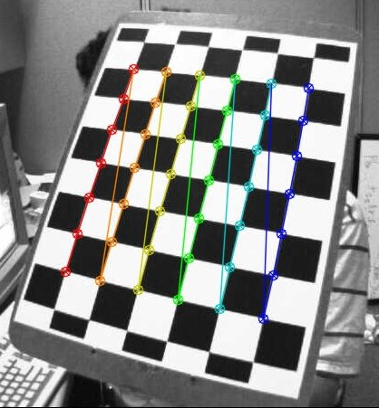

# Camera Calibration for Multi-Camera 3D Extraction  

This document outlines some of the processes required to perform camera calibration to extract `intrinsic` and `extrinsic` parameters from the cameras. These parameters can then be used for multi-camera 3D pose extraction using openpose.  

It is important to note that intrisic and extrinsic parameters are specific to a camera. The parameters cannot be reused for another camera, however, once they are found for a particular camera, they **can be reused for that same camera**, the calibration process does not need to be repeated.  

There are 4 parameters required to calibrate a camera:  

* Intrinsic  

    1) Camera Matrix  
    2) Distortion Coefficients  

> `Intrinsic` parameters are specific to a camera. They include information like focal length and optical centers. The focal length and optical centers can be used to create a *camera matrix*, which can be used to remove *distortion* due to the lenses of a specific camera.  

* extrinsic  

    3) Rotation Vectors  
    4) Translation Vectors  

> Extrinsic parameters correspond to rotation and translation vectors which translates coordinates of a 3D point to a coordinate system.  
>  
> *Note: For stereo applications, the camera distortions need to be corrected first.*  

## Calibration Prelim  

Prior to starting the calibration process, we need a chess board to help define the distortion coefficient values for our camera. The chess board is simply used as a well defined pattern from which there are specific measurable points we can define and reference.  

> Chess squares can be measured on the surface they are printed, thus, we can define "*real world*" coordinates of the square intersections.  
>  
> Using OpenCV, we can also run a function that can find the "*pixel coordinates*" of the square intersections from a captured image.  
>  
> These two sets of coordinates will help us perform our calibration.  
>  
>   

## Calibration Setup  

To perform our camera calibration we will need 3 things:  

1) 10-14 images of the chess board from varying distances and angles  
2) The 3D real world coordinates of the square intersection points  

> * `objpoints` : The total set of 3D real world coordinates of the square intersections for all calibration images   
>  
> These coordinates represent the intersection points of the chess squares in the real world. To define 3D real world coordinates for the intersection points, it is okay to assume the board is `fixed against the Z-axis at Z = 0`. We can also specify the X-axis and Y-axis components in whatever units we would like. The easiest variation is by specifying relative to the square:  
>  
> ie. (0,0,0) , (1,0,0) , (2,0,0) ... (1,3,0) ... (6,5,0)  
>  
> The Z component of our coordinate vectors will always remain equal to 0.  
>  
> **NOTE:** Although we need multiple images for the calibration, it is assumed that the camera is moving about the world space and the board remains fixed in place, thus, the *objpoints* array will `contain multiple sets of the same vectors` since the board is not moving (its coordinates are not changing).  

3) The 2D image coordinates of the square intersection points  

> * `imgpoints` : The total set of 2D image coordinates of the square intersections for all calibration images  
>  
> These coordinates represent the intersection points of the chess squares in the image space. To get the 2D image coordinates of the intersection points, we can run the `OpenCV : Function : findChessBoardCorners()` function on our calibration images which will automatically extract the coordinates for us.  

**NOTE:** It is important to specify the correct chess board size for finding the *imgpoints* as well as defining the correct coordinates for *objpoints* because...  

* Each `objpoint` must correlate to the same intersection point from `imgpoint`

Below is a block of *python* code that is used to get the *objpoints* and *imgpoints* from a set of calibration images:  

```Python
import numpy as np
import cv2 as cv
import glob

# termination criteria
criteria = (cv.TERM_CRITERIA_EPS + cv.TERM_CRITERIA_MAX_ITER, 30, 0.001)

# prepare object points, like (0,0,0), (1,0,0), (2,0,0) ....,(6,5,0)
objp = np.zeros((6*7,3), np.float32)
objp[:,:2] = np.mgrid[0:7,0:6].T.reshape(-1,2)

# Arrays to store object points and image points from all the images.
objpoints = [] # 3d point in real world space
imgpoints = [] # 2d points in image plane.

images = glob.glob('*.jpg')

for fname in images:
    img = cv.imread(fname)
    gray = cv.cvtColor(img, cv.COLOR_BGR2GRAY)

    # Find the chess board corners
    ret, corners = cv.findChessboardCorners(gray, (7,6), None)

    # If found, add object points, image points (after refining them)
    if ret == True:
        objpoints.append(objp)

        corners2 = cv.cornerSubPix(gray,corners, (11,11), (-1,-1), criteria)
        imgpoints.append(corners2)
```  

## Performing Calibration  

To get our 4 calibration parameters, we can perform `OpenCV : Function : calibrateCamera()`:  

```Python
ret, mtx, dist, rvecs, tvecs = cv.calibrateCamera(objpoints, imgpoints, gray.shape[::-1], None, None)
```  

**ret** : A boolean return of whether the function executed successfully or not.  
**mtx** : The Camera Matrix.  
**dist** : The Distortion Coefficients.  
**rvecs** : The Rotation Vectors.  
**tvecs** : The Translation Vectors.  

---  

*I have used openCV to find my camera matrix, distortion coefficients, rotation vectors, and translation vectors. How can I use these with my triangulation calculation?*  

You can use the camera matrix, distortion coefficients, rotation vectors, and translation vectors obtained from OpenCV for triangulation. Here’s how you can do it:

Undistort Points: First, you need to undistort the points detected in your images using the distortion coefficients obtained from the camera calibration. You can use the cv::undistortPoints() function in OpenCV for this1.

Create Projection Matrices: Next, you need to create the projection matrices for your cameras. The projection matrix is a 3x4 matrix that transforms a point in 3D space to its corresponding position in the 2D image. It is obtained by multiplying the camera matrix with the [R|t] matrix, where R is the rotation matrix and t is the translation vector1.

Triangulate Points: Finally, you can use the cv::triangulatePoints() function in OpenCV to triangulate the points. This function takes as input the projection matrices of your cameras and the corresponding points in the two images, and outputs the 3D coordinates of the points1.

Here’s a code snippet that shows how to do this:  

```Python
import cv2
import numpy as np

# Load your camera parameters
camera_matrix = np.load('camera_matrix.npy')
dist_coeffs = np.load('dist_coeffs.npy')
rvecs = np.load('rvecs.npy')
tvecs = np.load('tvecs.npy')

# Undistort your points
points_undistorted = cv2.undistortPoints(points, camera_matrix, dist_coeffs)

# Create the projection matrices
R, _ = cv2.Rodrigues(rvecs)
P1 = np.dot(camera_matrix, np.hstack((R, tvecs)))

# Triangulate the points
points_3D = cv2.triangulatePoints(P1, P2, points_undistorted)
```  

*what are P1 and P2?*  

In the context of 3D reconstruction and the cv2.triangulatePoints() function, P1 and P2 are the projection matrices for the two cameras12.

A projection matrix is a 3x4 matrix that transforms a point in 3D space to its corresponding position in the 2D image1. It is obtained by multiplying the camera matrix with the [R|t] matrix, where R is the rotation matrix and t is the translation vector1.

In the case of stereo vision, you would have two cameras, and thus two projection matrices, P1 and P2. These matrices are used in the cv2.triangulatePoints() function to triangulate the points and find their 3D coordinates.  

*what is happening in this line? R, _ = cv2.Rodrigues(rvecs)*  

The line R, _ = cv2.Rodrigues(rvecs) is using the cv2.Rodrigues() function from OpenCV1. This function converts a rotation matrix to a rotation vector, and vice versa1.

In this case, rvecs is the rotation vector obtained from the camera calibration process. The cv2.Rodrigues(rvecs) function converts this rotation vector into a rotation matrix1.

The function returns two values:

The first value is the result of the conversion. If the input was a rotation vector, the output will be a rotation matrix, and vice versa1.
The second value is the Jacobian matrix of the function, which contains the partial derivatives with respect to the input parameters1.
In the line R, _ = cv2.Rodrigues(rvecs), the _ is a common Python convention for discarding the second return value because the Jacobian matrix is not needed in this context1.

So, R is the rotation matrix converted from the rotation vector rvecs1. This rotation matrix can then be used for various computer vision tasks, such as 3D reconstruction1.  

*I have an array of 25 different 3D points, I want to get rid of the z-axis of each point and make them 2D points and use these 2D points in the cv2.undistortPoints() function. How can I do this?*  

```Python
import numpy as np

# Initialize an empty list
points = []

# Let's say you have a function `get_point()` that returns a new point each time it's called
for _ in range(25):
    point = get_point()  # This should return a 3D point as a list or tuple, like [x, y, z]
    points.append(point[:2])  # Append the x and y coordinates to the list

# Convert the list to a numpy array
points_2d = np.array(points)

# Now you can use these 2D points in the cv2.undistortPoints() function
points_undistorted = cv2.undistortPoints(points_2d, camera_matrix, dist_coeffs)
```

>I have a python application that calibrates two cameras using OpenCV and calculates coordinates of points based on two images from the cameras. I have the following lines of code:
>
>ret, mtx, dist, rvecs, tvecs = cv2.calibrateCamera(objpoints, imgpoints, gray.shape[::-1], None, None)
>R_Left, _ = cv2.Rodrigues(rvecs)
>proj_Left = np.dot(left_cam_dict['cam_mtx'], np.hstack((R_Left, left_cam_dict['trans_vecs'])))  
>
>When I try to run the cv2.Rodrigues() function I get the error: 
>
>TypeError: Expected Ptr<cv::UMat> for argument 'src'
>
>can you explain why I am getting this error and how I can fix it?  

The error message TypeError: Expected Ptr<cv::UMat> for argument 'src' is indicating that the cv2.Rodrigues() function is expecting a certain type of input, specifically a cv::UMat object, but it’s not receiving it.

In your case, rvecs is a list of rotation vectors, and each rotation vector is a 3x1 array. The cv2.Rodrigues() function converts a rotation matrix to a rotation vector or vice versa1. However, it seems like you’re passing the entire list of rotation vectors to the function, which might be causing the issue.

You should call cv2.Rodrigues() on individual rotation vectors. Here’s how you can do it:

Python
AI-generated code. Review and use carefully. More info on FAQ.

R_Left = [cv2.Rodrigues(rvec)[0] for rvec in rvecs]  
This will give you a list of rotation matrices corresponding to each rotation vector. If you want to use only one rotation vector, make sure to select it correctly from the list. For example, if you want to use the first rotation vector, you can do:

Python
AI-generated code. Review and use carefully. More info on FAQ.

R_Left, _ = cv2.Rodrigues(rvecs[0])  

>I have multiple rotation vectors returned from the camera calibration function. Is there a way I should pick one of the vectors? does it matter which one I use?  

The rotation vectors you get from the cv2.calibrateCamera() function correspond to the different images used for calibration. Each rotation vector represents the rotation of the camera for a particular image of the calibration pattern12.

If you’re using these rotation vectors for something like 3D reconstruction or pose estimation, the choice of rotation vector would depend on the specific image or view you’re interested in. For example, if you’re trying to understand the pose of the camera in the first image you used for calibration, you would use the first rotation vector.

If you’re just testing your code and want to see if the rotation matrix is being computed correctly, you can use any rotation vector. The important thing is to ensure that you’re using the corresponding translation vector (from tvecs) with it12.

Remember, each of these rotation vectors is specific to the image of the calibration pattern it corresponds to. So, the choice of rotation vector (and the corresponding translation vector) should align with the specific image or view you’re working with  

>the two cameras parameters are fixed and their position and distance relative to each other are fixed. These will never change. is calculating one projection matrix feasible?  

Yes, if the two cameras’ parameters are fixed and their positions and distances relative to each other are also fixed, then you can calculate a projection matrix for each camera that will remain constant as long as these conditions are met.

You would perform the calibration process for each camera separately to obtain the intrinsic parameters (camera matrix) and the extrinsic parameters (rotation and translation vectors) for each camera.
