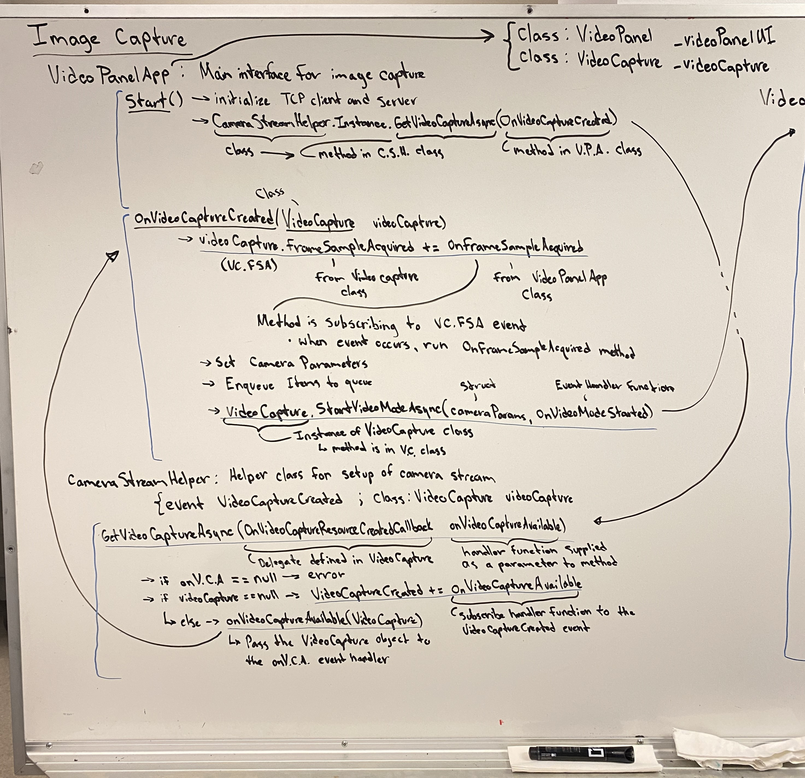
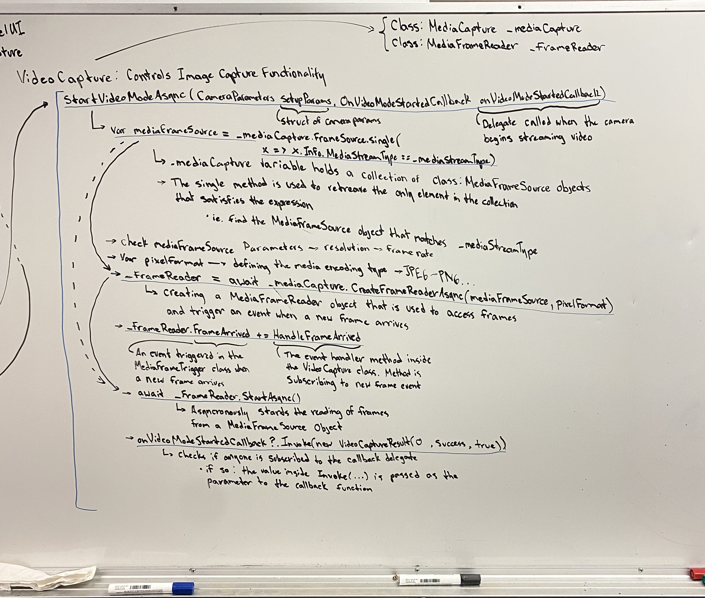
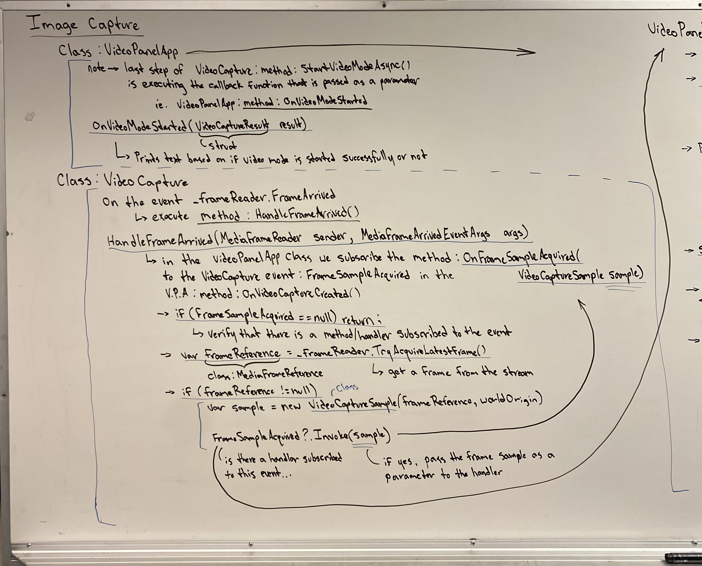
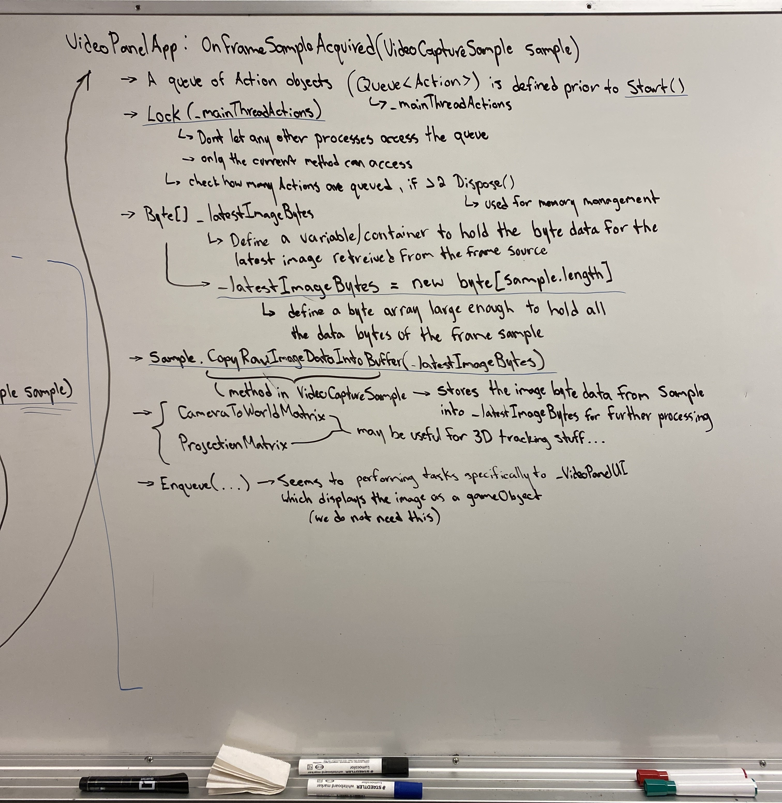

# Camera Data Stream Flow  
*Brayden Shkwarok - September 19, 2023*

This document outlines the program flow of the camera stream from initialization to image stream where we can access the images for processing in openpose.  

|Class|Methods|
|-|-|
|VideoPanelApp|- void Start() <br /> - void OnVideoCaptureCreated(VideoCapture videoCapture) <br /> - void OnVideoModeStarted(VideoCaptureResult result) <br /> - void OnFrameSampleAcquired(VideoCaptureSample sample)|  
|CameraStreamHelper|- public void GetVideoCaptureAsync(OnVideoCaptureCreatedCallback onVideoCaptureAvailable)|  
|VideoCapture|- public async void StartVideoModeAsync(CameraParameters setupParams, OnVideoModeStartedCallback onVideoModeStartedCallback) <br /> - void HandleFrameArrived(MediaFrameReader sender, MediaFrameArrivedEventArgs args)|  

---  

The `method : Start()` method inside the `class : VideoPanelApp` class is a pre-defined method in Unity that is run once upon initialization of the application. This helps initialize any setup required before the application starts.  

```C#
class VideoPanelApp
{
    public RawImage depthimage;
    byte[] _latestImageBytes; // The data for the newest image in the stream

    public VideoPanel _videoPanelUI;
    VideoCapture _videoCapture;

    // ... 

    void Start()
    {
        // initialize TCP client
        // initialize TCP server

        CameraStreamHelper.Instance.GetVideoCaptureAsync(OnVideoCaptureCreated);
    }

    // ...
}
```  

* `class : CameraStreamHelper` is a class defined to help initialize the stream of data from the camera on the HoloLens.  
* `method : GetVideoCaptureAsync(OnVideoCaptureCreatedCallback onVideoCaptureAvailable)` is a method inside the *CameraStreamHelper* class  
    * `OnVideoCaptureCreatedCallback` is a delegate defined in the *VideoCapture* class. It is however defined as an **event** in the *CameraStreamHelper* class.  
        * The variable name defined for the event is `VideoCaptureCreated`  
        ```C#
        event OnVideoCaptureCreatedCallback VideoCaptureCreated
        ```   
    * `onVideoCaptureAvailable` is a pointer variable that points to an event handler method.  This method is supplied as a parameter to the *GetVideoCaptureAsync()* method.  

```C#
class CameraStreamHelper
{
    event OnVideoCaptureCreatedCallback VideoCaptureCreated;
    static VideoCapture videoCapture;

    // ...

    public void GetVideoCaptureAsync(OnVideoCaptureCreatedCallback onVideoCaptureAvailable)
    {
        // no handler method defined
        if (onVideoCaptureAvailable == null) "error";

        // if no VideoCapture instance is defined, subscribe event handler
        // method to VideoCaptureCreated event
        if (videoCapture == null) VideoCaptureCreated += onVideoCaptureAvailable;
        // call event handler and pass VideoCapture instance as the parameter.
        // else is likely used in the case of a reset where we have already subscribed
        // to the event and dont need to do it a second time
        else onVideoCaptureAvailable(videoCapture);
    }

    // ...
}
```  

*Note:* The above method is not itself calling/creating an Async, it is instead handling the attachment of the event of a *VideoCapture* object being created to the event handler method that then starts the video capture process.  

When the `class : VideoCapture` instance is created/defined, it is passed back to the event handler method *OnVideoCaptureCreated()* in the *VideoPanelApp* class that then starts the video stream proccess.  

```C#
class VideoPanelApp
{
    // ...

    void OnVideoCaptureCreated(VideoCapture videoCapture)
    {
        // storing VideoCature object to local class variable
        this._videoCapture = videoCapture;

        // get camera resolution and framerate

        // subscribe the OnFrameSampleAcquired handler method to the event
        // FrameSampleAcquired that occurs within the VideoCapture class
        videoCapture.FrameSampleAcquired += OnFrameSampleAcquired;

        // define the camera parameters in the cameraParams struct

        // enqueue SetText and SetResolution tasks to queue

        // start the video mode Async
        videoCapture.StartVideoModeAsync(cameraParams, OnVideoModeStarted);
    }

    // ...
}
```  

The `method : OnFrameSampleAcquired()` method is defined within the *VideoPanelApp* class. It is being subscribed to the `event : FrameSampleAcquired` event that occurs within the *VideoCapture* class.   
* When the *FrameSampleAcquired* event occurs, the *OnFrameSampleAcquired* method will be executed.  

Using the defined *class : VideoCapture* instance `videoCapture`, we call the method `method : StartVideoModeAsync()` with the specified camera parameters for setup of the video stream from the camera. We also supply the event handler method `method : OnVideoModeStarted()` from the *VideoPanelApp* class. This is used to create the Async task that starts the stream of data from the camera.  

```C#
class VideoCapture
{
    MediaCapture _mediaCapture;
    MediaFrameReader _freameReader;

    // ...

    public async void StartVideoModeAsync(CameraParameters setupParams, OnVideoModeStartedCallback onVideoModeStartedCallback)
    {
        // _mediaCapture holds multiple objects. Find the object that matches
        // the query and store it to mediaFrameSource
        var mediaFrameSource = _mediaCapture.FrameSource.Values.Single(x => x.Info.MediaStreamType == _mediaStreamType);

        // check mediaFrameSource parameters against setupParams
        // if they differ, then make necessary changes

        // define the media encoding type and store to var pixelFormat

        // create a MediaFrameReader object that is used to access frames and trigger
        // an event when new frames arrive
        _frameReader = await _mediaCapture.CreateFrameReaderAsync(mediaFrameSource, pixelFormat);

        // subscribe the HandleFrameArrived method to the event created by the 
        // frame reader each time that a new frame arrives
        _frameReader.FrameArrived += HandleFrameArrived;

        // Start the reading of frames process using the created frame reader
        await _frameReader.StartAsync();

        // if the variable onVideoModeStartedCallback is not null, Invoke the handler 
        // method and pass VideoCaptureResult object as the parameter 
        onVideoModeStartedCallback?.Invoke(new VideoCaptureResult(0, ResultType.Success, true));
    }

    // ...
}
```  

Our `MediaCapure : Object : _mediaCapture` holds a collection of `class : MediaFrameSource` objects  
* The *expression (x => x.Info.MediaStreamType == _mediaStreamType)* is used as a means of extracting the particular *MediaFrameSource* object that we want to use to isolate and interact with our video stream frames.  

The `MediaCapture : method : CreateFrameReaderAsync()` method is used to create a `class : MediaFrameReader` object that is used to acquire frames with the specified media encoding subtype and size from a `class : MediaFrameSource`  
* [MediaCapture.createMediaFrameReaderAsync() | link](https://learn.microsoft.com/en-us/uwp/api/windows.media.capture.mediacapture.createframereaderasync?view=winrt-22621#windows-media-capture-mediacapture-createframereaderasync(windows-media-capture-frames-mediaframesource-system-string))  

Next, we attach the `method : HandleFrameArrived` method to the *MediaFrameReader* `event : frameArrived`. When the *FrameArrived* event occurs, the HandleFrameArrived method will be invoked.  

We then start the reading of frames using the `MediaFrameReader : method : StartAsync()` method and our *mediaFrameSource* object which was used to initialize the frame reader.  

In our last line, the " ? " syntax is used to check if the given variable is *null*. In this case, we are checking to see if a callback/handler method has been passed and stored in `variable : onVideoModeStartedCallback`. If the variable is not null, then invoke/execute the method.  
* The " .Invoke( *object* ) " syntax is used to pass an object as a parameter to the callback method.  
* In this case, a new `struct : VideoCaptureResult` object is initialized and passed to the callback method as its parameter. 

---  

  



---  

The handler method parameter passed to the *VideoCapture : method : OnFrameSampleAcquired()* method is the `VideoPanelApp : method : OnVideoModeStarted()` method. When the *onVideoModeStartedCallback* is verified to not be null, the callback function is enacted and passed the *VideoCaptureResult* object as its parameter.  

```C#
class VideoPanelApp
{
    // ...

    void OnVideoModeStarted(VideoCaptureResult result)
    {
        if (result.Success == false) "could not start video mode";
        else "video capture started!";
    }

    // ...
}
```  

`method : OnVideoModeStarted` is simply used as a text output/log that the video mode has either failed to start or successfully started.  

* **The setup process has now been completed.**  

Because of the Async we created with our `instance : MediaFrameReader` object, `event : FrameArrived` events should continually occur while the application is running. For any handler methods that subscribe to this event, when the event occurs, the handler should be triggered and executed.  

In the `class : VideoCapture` class, we have subscribed the `method : HandleFrameArrived()` method to the *FrameArrived* event. This subscription was done in the `VideoCapture : method : StartVideoModeAsync()` method. 

```C#
class VideoCapture
{
    // ...

    // on the event _frameReader.FrameArrived, execute method
    void HandleFrameArrived(MediaFrameReader sender, MediaFrameArrivedEventArgs args)
    {
        // check that handler is subscribed to event
        if (FrameSampleAcquired == null) return;

        using (var frameReference = _frameReader.tryAcquireLatestFrame())
        {
            // if frame reference holds the latest frame (not empty)
            if (frameReference != null)
            {
                // create frame sample
                var sample = new VideoCaptureSample(frameReference, worldOrigin);
                // trigger event and pass image sample to handler
                FrameSampleAcquired?.Invoke(sample);
            }
        }
    }

    // ...
}
```  

In the *HandleFrameArrived()* method we first try to retreive the latest frame from our frame reader object and store this into the `var : frameReference` variable. If we were successful in getting the latest frame from our frame reader object, we then create a new `class : VideoCaptureSample` instance which is used to hold and pass our frame sample data to the handler method that will save the frame data in a form that we can use for our own processes.  

In our last line we verify that the `event : FrameSampleAcquired` event has a subscriber, then triggers the event and passes the frame sample as a parameter to the handler. That handler method is `VideoPanelApp : method : OnFrameSampleAcquired()` in the *VideoPanelApp* class.  

```C#
class VideoPanelApp
{
    byte[] _latestImageBytes;

    // ...

    // execute when VideoCapture.FrameSampleAcquired event is triggered
    void OnFrameSampleAcquired(VideoCaptureSample sample)
    {
        Lock(_mainThreadActions)
        {
            if (_mainThreadActions.count > 2)
            {
                // memory management
                sample.Dispose();
                return;
            }
        }

        // defining an array/container to store the byte data of the latest frame.
        // if all the data fits in the container, jump straight to copy to buffer
        if (_latestImageBytes == null || _latestImageBytes.Length < sample.dataLength)
        {
            _latestImageBytes = new byte[sample.dataLength];
        }
        
        // storing the image data to container
        // THIS IS YOUR FRAME/IMAGE
        sample.CopyRawImageDataIntoBuffer(_latestImageBytes);

        // other tasks related to:
        // - CameraToWorldMatrix
        // - ProjectionMatrix
        // - Enqueue actions specific to _videoPanelUI which is not used in our case
    }

    // ...
}
```  

*Note:* `queue : _mainThreadActions` may not be necessary. It is mainly used for updating the UI panel that is displayed to the user via a gameObject. This functionality is not being used by our program and may be irrelivent.  

The handler method takes our frame sample `VideoCaptureSample : object : sample` and stores copies the image data into our buffer `byte[] : _latestImageBytes`. It is with this variable that we now have our image/frame. We can then pass our captured frame through TCP to be processed by openpose.  

---  

  

  

---  