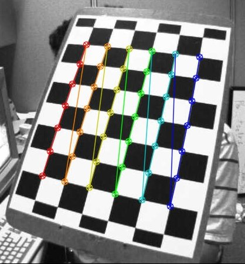

# Spatial Image Processing  

1. Module : HLCameraCalibration  
2. Module : ImageRectification  
3. Module : Triangulation  

# 1. Module : HLCameraCalibration  

## Function List  

```Python
def OpenCV_Chess_Calibration(left_cam_path, right_cam_path):
    return True
def Calculate3DCoordiantes(img_left, img_right, coordL, coordR):
    return coordinate_output
def convert_string_to_npArray(OP_Coord_String):
    return np_coord_array.astype(np.float32)
```  

## Module Description  

The `module : HLCameraCalibration` module is used for performing two main functions:  

* Processing the captured chessboard calibration images to calculate camera parameters for the front stereo cameras  
* Calculating the depth value at each joint coordinate using the stereo images and Openpose coordinate sets  

The `module : HLCameraCalibration` module handles everything related to the front stereo cameras and the depth capture calculations.  

> <https://github.com/niconielsen32/ComputerVision/tree/master/StereoVisionDepthEstimation>  
> The above code library is the basis of the camera calibration and depth capture functionality.  
>  
> <https://www.youtube.com/watch?v=uKDAVcSaNZA>  
> Video is by the creater of the above code. This video walks through the process of calibration and depth capture and is what was used to establish the current implementation of the `module : HLCameraCalibration` module.  

## Stereo Camera Calibration  

The calibration process is an important step in being able to rectify the stereo camera images and perform accurate calculations from them. The `function : OpenCV_Chess_Calibration()` function is used to create and store calibration parameters for the front spatial cameras. These calibration parameters are used to remove distortions from the spatial images and improve the quality of the depth calculation that occurs.  

### Calibration Images  

When the unity application first loads, the app loads into the `scene : Camera Calibration` scene. This scene is used for capturing calibration images from the front stereo cameras and triggering the calibration operation.  

The camera calibration **images must contain a chess board** for them to be accepted and used for the calibration process (see image below). The more calibration images that are captured, the better the calculated calibration parameters will be.  

  

> *Note:* It is important to note that when capturing calibration images, the chessboard must be contained within the image frame. It is also important to capture images of the board from varying angles and distances (close, far, left, right, oblique etc.) for the camera distortions and parameters to be determined correctly.  

The first step of the `function : OpenCV_Chess_Calibration()` function is to go through the calibration images and determine if they are acceptable images to be used for the calibration step. This is done by the `OpenCV : function : findChessboardCorners()` function. If both the left and right images are valid, they will be used for calculating the camera calibration parameters.  

### Calibration Image Processing  

The basis of the calibration step is to be able to calculate and correct any imperfections or distortions caused by the camera and camera lens. These values are determined by correlating real world coordinates of the chessboard grid intersection points with the pixel coordinates of the chessboard grid intersection points.  

The real world coordinates of the grid intersection points are defined as follows:  

```Python
# prepare object points, like (0,0,0), (1,0,0), (2,0,0) ....,(6,5,0)
objp = np.zeros((6*7,3), np.float32)
objp[:,:2] = np.mgrid[0:7,0:6].T.reshape(-1,2)
```  

To correlate the real world and image coordinates, we need an object that stores the real world grid coordinates. This object is `object : objp`. To define 3D real world coordinates for the chessboard intersection points, we will asume that the board lies flat against the plane `z = 0`. Making this assumption allows us to easily determine the coordinates of each intersection by specifying the first grid coordinate as (0, 0, 0). From the first grid coordinate we can either measure the X and Y distances to the next grid point, or we can again make an assumption that each grid is `1 unit X 1 unit`. This allows us to specify the real world coordinate of each grid intersection point as (1, 0, 0), (2, 0, 0), ..., (3, 4, 0) and so forth. Because we are moving the camera around the chessboard, the real world coordinates of the chess board stay the same for every image.  

For each calibration image we need a set of real world coordinates and a set of image pixel coordinates. For each image, a set of coordinates is stored to the following lists:  

```Python
objpoints = [] # 3d points in real world space
imgpointsL = [] # 2d points in LEFT image plane.
imgpointsR = [] # 2d points in RIGHT image plane.  

# ...

retL, cornersL = cv2.findChessboardCorners('''left-image''', chessboardSize, None)
retR, cornersR = cv2.findChessboardCorners('''right-image''', chessboardSize, None)

# check whether the calibration images are valid or not
if retL and retR == True:
    valid_img_count += 2
    objpoints.append(objp)

    cornersL = cv2.cornerSubPix(grayL, cornersL, (11,11), (-1,-1), criteria)
    imgpointsL.append(cornersL)

    cornersR = cv2.cornerSubPix(grayR, cornersR, (11,11), (-1,-1), criteria)
    imgpointsR.append(cornersR)
```  

For each valid set of calibration images, the `set : objp` set is added to the `list : objpoints` list. Note that the `object : objp` object is never modified or changes, thus, the `list : objpoints` list is made up of multiple duplicate sets of real world grid coordinates. This is because the chessboard is assumed to be fixed in space (the camera moves, the board doesnt).  

Along with the **objp** point set, the pixel coordinates of each grid intersection are also calculated and stored for each of the left and right image. For each item in the `list : objpoints` list, there is a corresponding item in the `list : imgpointsL` and `list : imgpointsR` lists. Note that because the location of the chessboard in each of the calibration images will vary, the grid intersection pixel coordinates will also be different for every entry into the image points lists.  

### Camera Calibration Parameter Calculation  

The camera calibration and depth calculation are new processes implemented into the application and little is understood at this time about what values are being calculated, what their purposes are, and how they can be used to improve the depth calculation capability of the application. The video link noted above in the *Module Description* section is the basis of the implementation being used. The channel appears to have other videos discussing the topic and may be able to provide more information about the calibration process.  

Camera calibration is still an area of research and development. More work will be required to understand how to effectively use these components.  

In the `function : OpenCV_Chess_Calibration()` function, the sections:  

```Python
### Calibration ###
...
### Stereo Vision Calibration ###
...
### Stereo Rectification ###
...
```  

will require further investigation and research into the functions used and the explination and purpose or each of the returned/calculated variables.  

### Camera Calibration Parameter Storage  

Once the stereo camera calibration process is complete, the calculated camera parameters are stored to an `file : *.xml` file (`file name : "stereoMap.xml"`) so that the camera calibration only needs to be executed a single time. Once the calibration is complete, we will be able to extract and use the stored calibration parameters to perform our depth calculation without needing to re-calibrate the cameras as long as they remain fixed in place.  

## Stereo Depth Calculation  

To fulfill the task of performing 3 dimensional body tracking, we are able to extract X and Y positional coordinates from a 2 dimensional image. By extracting the pixel coordinate of each body joint, we can scale the coordinates to match that of the real world size of the user. To capture the Z or depth component, we are making use of the front facing stereo spatial cameras on the HoloLens 2 device.  

> **Stereo Vision**: Having two visual inputs that are fixed and offset from each other is what allows us to see and perceive depth (depth perception). In the same way our eyes work, capturing two images from a set of fixed stereo cameras gives us the ability to calculate depth from the images.  
>  
> To perform this calculation we must know some information about the cameras, their lenses, and their positions in space (camera calibration parameters).  

Depth is calculated using the `function : Calculate3DCoordinates()` function. To perform the depth calculation we must pass the function both left and right images of the spatial set, as well as the calculated Openpose coordinates for both the left and right images. Two processes are required before we can calculate the depth coordinate from our stereo images:  

1. **Undistort** the captured stereo images before can properly utilize them properly  
2. Extract the (X, Y) sets from each joint coordinate so that the the X and Y values can be used during the depth determination step  

Once the distortions have been resolved and the (X, Y) sets have been extracted, we can use the `Triangulation : function : find_depth()` function to calculate the depth value for each coordinate.  

**Note:** The function `function : convert_string_to_npArray()` is used as a means of extracting the X, Y float values from the string return produced by Openpose, such that the X, Y pixel values can be used to calculate the depth parameter.  

# 2. Module : ImageRectification  

## Function List  

```Python
def undistortRectify(frameL, frameR):
    return undistortedL, undistortedR
```  

## Module Description  

The `module : ImageRectification` module is used for accessing the stereo camera calibration file and using it to resolve/fix distortions in the images captured by the stereo cameras. This fixing of distortions is done by the `function : undistortRectify()` function found in this module.  

It is notable that this module is **imported into the HLCameraCalibration** module. By importing this module, the code:  

```Python
# Camera parameters to undistort and rectify images
cv_file = cv2.FileStorage()
cv_file.open('stereoMap.xml', cv2.FileStorage_READ)

stereoMapL_x = cv_file.getNode('stereoMapL_x').mat()
stereoMapL_y = cv_file.getNode('stereoMapL_y').mat()
stereoMapR_x = cv_file.getNode('stereoMapR_x').mat()
stereoMapR_y = cv_file.getNode('stereoMapR_y').mat()
```  

Is executed automatically, accessing the camera calibration file `file : stereoMap.xml` that holds all of the calibration values that are used to remove distortions. These values are stored to the `variables : stereoMap*` variables and are accessable during the runtime of the application. This allows us the ability to quickly remove distortions from each stereo image pair.  

# 3. Module : Triangulation  

## Function List  

```Python
def find_depth(left_point, right_point, frame_left, frame_right, baseline, f, fov):
    return zDepth
```  

## Module Description  

The `module : Triangulation` module serves the sole purpose of calculating the depth value of each body joint using the pixel coordinates of each joint returned by Openpose.  

I am not familiar with what the calculation is actually doing, as well, depth calculation is an active area of research for this project. The Youtube and Github links at the top of the document are from the source where the stereo depth calculation code comes from, of which, the youtube channel linked has multiple videos discussing this stereo calculation and how its done. This may be a good starting point for further investigation into how to improve the stereo depth calculation.

