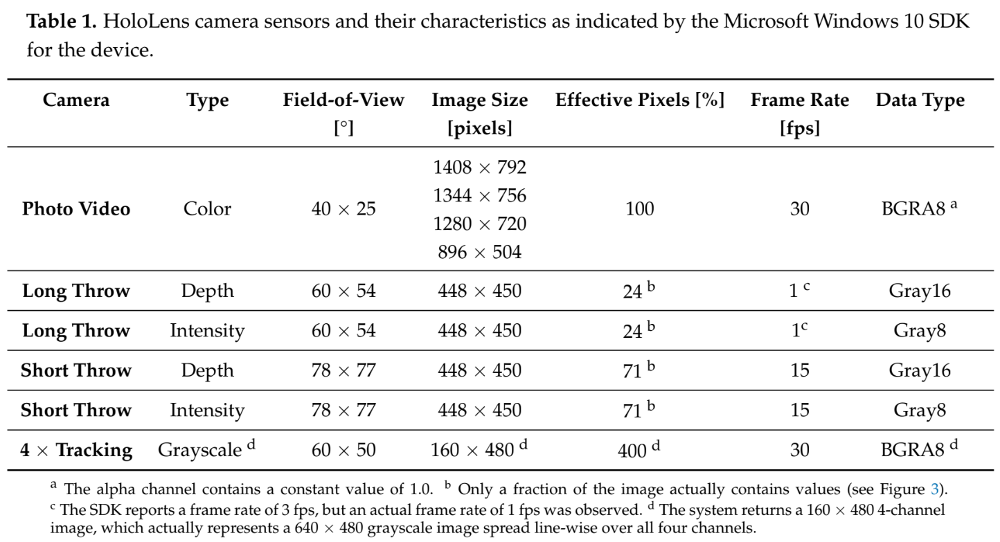

# Class : StereoCameraStream  

## Methods List  

```C#
private void Awake();
void Start();
void Update();
private bool SaveSpatialImageEvent();
public async void CalibrationFrameCapture();
public void BodyTrackingFrameCapture();
public void StartCameraCalibration();
public void LoadBodyTrackingScene();
private int Garbage(int, int);
```  

## Class Description  

The `class : StereoCameraStream` class is a unity MonoBehavior script class that directly controls the functionality of capturing image frames from the HoloLens 2 headset and sending the data to the remote TCP Server on the connected computer.  

The script makes use of the `plugin : HL2UnityPlugin` plugin that allows access to the cameras and depth sensors of the headset. This class makes direct use of the access to the **front facing left and right spatial cameras** for capturing stereo images to performing joint coordinate calculations.  

## Spatial Camera Parameters  

 

## Initialization  

when the application is started, our `Unity : method : Start()` method will be executed, initializing our class object.  

We start by initializing the HL2UnityPlugin, getting the front spatial cameras setup and ready for frame capture. The plugin also gets a reference to the spatial coordinate system.  

```C#
HL2ResearchMode researchMode;
SpatialCoordinateSystem _spatialCoordinateSystem;

// ...

void Start()
{
    // ...

    researchMode = new HL2ResearchMode();

    researchMode.InitializeSpatialCamerasFront();
    researchMode.StartSpatialCamerasFrontLoop();
    researchMode.SetReferenceCoordinateSystem(_spatialCoordinateSystem);
    _spatialCoordinateSystem = Microsoft.MixedReality.OpenXR.PerceptionInterop.
                                GetSceneCoordinateSystem(UnityEngine.Pose.
                                identity) as SpatialCoordinateSystem;

    // ...
}
```  

Next we need to get a reference to TCP Client class. Once we have a reference to the class, we will call the `TCPClient : method : start_tcp_client_connection()` method to create a link with the remote TCP Server. Once a connection has been established, we can start sending our captured images to the remote TCP Server.  

## Image Capture  

Images are captured from the HoloLens 2 via the `method : SaveSpatialImageEvent()` method. This method makes use of two HL2UnityPlugin functions:  

```C#
private bool SaveSpatialImageEvent()
{
    // ...

    // get the front left camera image buffer
    byte[] leftImage = researchMode.GetLFCameraBuffer(out ts_ft_left);
    // get the fri=ont right camera image buffer
    byte[] rightImage = researchMode.GetRFCameraBuffer(out ts_ft_right);

    // ...
}
```  

The `HL2ResearchMode : function : Get_FCameraBuffer()` is used to capture a byte array of data. This byte array contains the image data bytes for the respective camera image frame. The function also captures the timestamp of when the image was captured (this will later be used for our filename on the remote TCP Server side of the application). These byte arrays are our captured images.  

To effectively send our images over TCP, we combine both images into a single byte array. This allows us to better transmit the data all at once, from which it can be decoded on the remote server end.  

## Image Transmission  

There are two methods of sending images to the remote TCP Server. One is sending calibration images which are stored to a calibration folder for later use with the calibration functionality. The other is sending the body tracking image stream for processing via Openpose.  

### Calibration Image Transmission  

The calibration image capture/transmission is done using the `method : CalibrationFrameCapture()` method. This method is attached to the "*Capture*" button in the calibration scene and is used as an event handler for when the button has been pressed. Images are only captured and sent when the button is pressed.  

The method first displays an indicator to the user in the application, an image is captured, then the `TCPClient : method : SendSpatialImageAsync()` method is called to send the left/right spatial image buffer to the remote TCP Client. Note that the method is passed a header value of `header = c`. The header value "c" specifies to the remote TCP Server that the images we are sending are intended to be used for calibrating the front stereo cameras. The remote TCP Server will then process them accordingly. Once the spatial images have been sent, the indicator is turned off, signifying the image has been captured and sent.  

### Body Tracking Image Transmission  

The body tracking image capture/transmission is done using the `method : BodyTrackingFrameCapture()` method. This method is triggered automatically from the `Unity : method : Update()` method. On each new frame, we want to capture and send a new spatial image for processing via Openpose.  

The body tracking images are captured and stored to a queue. Image frames are dequeued and passed to the `TCPClient : method : SendSpatialImageAsync()` method to be sent to the remote TCP Server.  

> *Note:* A queue is used for capturing image frames to ensure a smoother motion playback upon return of the Openpose joint coordinate frames. This stops image frames from being skipped over if the TCPClient hasnt finished sending the previous image data.  
>  
> If image frames are skipped over or missed, joint coordinate frames will also be missing causing the patient model to jump from pose to pose in an un-smooth manner.  
>  
> It is notable, however, that queueing the image frames may introduce latency/delay into the users actual movement and the movement of the patient model. This can be looked into to create improvements.  

When capturing body tracking images, we send the images using a header value of `header = f`. The header value "f" specifies to the remote TCP Server that the images we are sending are to be used for calculating body joint coordinates using Openpose.  

## Useful Links  

> <https://github.com/petergu684/HoloLens2-ResearchMode-Unity/blob/master/HL2UnityPlugin/HL2ResearchMode.h>  
> Link contains all the function signatures of the functions that can be called using the `class : HL2ResearchMode` class.  

> <https://github.com/petergu684/HoloLens2-ResearchMode-Unity/blob/master/UnitySample/Assets/Scripts/ResearchModeVideoStream.cs>  
> Link contains examples of the `class : HL2ResearchMode` class being used in C# and examples of how it is accessing the different sensor streams. I is notable that this sample appears to be displaying the data streams from the sensor to game objects in the unity scene such that the user can see the output in the headset. This may be useful at a later stage.  

> <https://github.com/EnoxSoftware/HoloLensCameraStream/tree/master>  
> This unity project is the basis of the old application and focuses around the use of the photo/video camera.  
>  
> Some associated Microsoft defined classes/resources used in the above implementation:  
> <https://learn.microsoft.com/en-us/windows/mixed-reality/develop/advanced-concepts/locatable-camera-overview#Camera_to_Application-specified_Coordinate_System>  
>  
> <https://learn.microsoft.com/en-us/uwp/api/windows.media.capture.mediacapture?view=winrt-22621>  
>  
> <https://learn.microsoft.com/en-us/uwp/api/windows.media.capture?view=winrt-22621>  
>  
> 